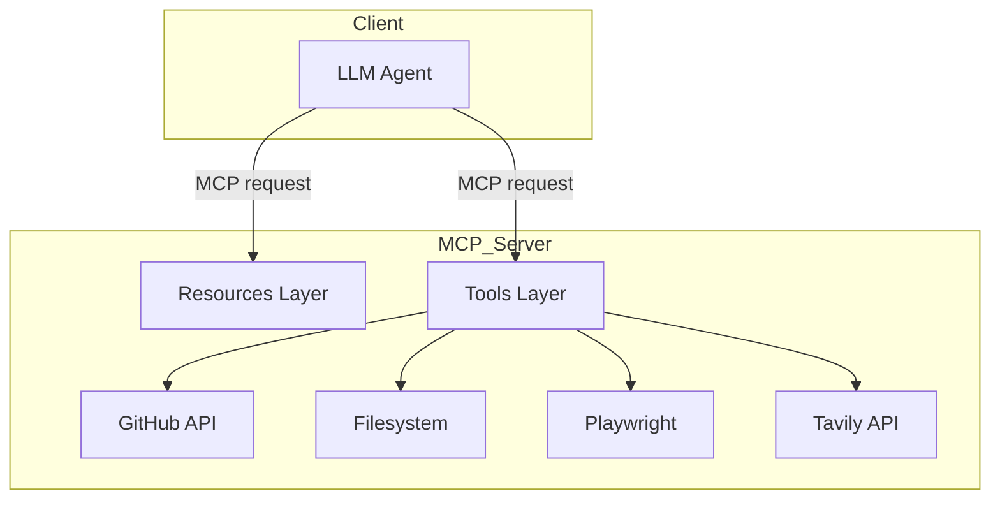

# MCP Server Capabilities

> **Version**: 0.1.0  
> **Runtime**: Python ≥ 3.10  
> **Modules**: FastMCP, PyGithub, Playwright (Python), Tavily API

---

## 1 High-Level Overview

This server is a **Model-Context Protocol (MCP)** endpoint that lets LLM agents interact with:

* **GitHub** – read repository data, issues, pull-requests, users.
* **Local Filesystem** – securely read, write, and list files/directories.
* **Web Browser Automation** – drive a headless Chromium instance for UI automation or scraping.
* **Web Search** – perform real-time AI-powered searches via Tavily.

All functionality is exposed through standard MCP **resources** (read-only URIs) and **tools** (imperative RPC-style actions). The server is completely stateless except for transient Playwright page objects held in memory during a session.


## 2 Environment Variables

| Variable | Required | Purpose |
|----------|----------|---------|
| `GITHUB_TOKEN` | ✔ | GitHub Personal Access Token used by all GitHub tools/resources. |
| `FS_ALLOWED_DIRS` | ✱ | Colon/semicolon separated list of absolute paths that file tools may access. Defaults to current working directory. |
| `TAVILY_API_KEY` | ✔ (for web search) | Auth key for Tavily search API. |

✱ *Not strictly required but highly recommended for security.*


## 3 Resources (Read-Only)

| URI Template | Description |
|--------------|-------------|
| `file://{file_path}` | Returns UTF-8 text content of `file_path` (must be inside `FS_ALLOWED_DIRS`). Large files are truncated to 100 KB. |
| `github://repos/{owner}/{repo}` | Structured JSON describing a repository. |
| `github://repos/{owner}/{repo}/issues` | Array with basic details of the first 10 open issues. |


## 4 Tools (Imperative Actions)

### 4.1 Filesystem

| Tool | Description | Main Params |
|------|-------------|-------------|
| `read_file` | Read file content. | `path` |
| `write_file` | Write text to file, optional overwrite. | `path`, `content`, `overwrite?` |
| `list_directory` | List entries in directory. | `path?` |

All paths are resolved and validated so they **must** reside under an allowed directory.

### 4.2 GitHub API

| Tool | Purpose |
|------|---------|
| `search_repositories` | Keyword search across GitHub. |
| `get_repository_info` | Detailed repo metadata. |
| `list_repository_issues` | Enumerate issues with filters. |
| `get_issue_details` | Full data for a single issue. |
| `list_pull_requests` | Enumerate PRs. |
| `get_user_info` | Public profile and statistics. |

All GitHub interactions use the user-supplied PAT and respect GitHub rate limiting.

### 4.3 Browser Automation (Playwright)

| Tool | Action |
|------|--------|
| `browser_open_page` | Launch new Chromium tab, navigate to URL, returns `page_id`. |
| `browser_close_page` | Close tab & free resources. |
| `browser_click` | Click CSS selector. |
| `browser_fill` | Fill or type into element. |
| `browser_get_text` | Extract `innerText` from element. |
| `browser_screenshot` | Return PNG screenshot as base64 data-URL. |

**Workflow Example**
```text
a = browser_open_page("https://example.com")  -> {"page_id":"abc123"}
browser_click(a.page_id, "#login")
browser_fill(a.page_id, "#username", "bot")
browser_screenshot(a.page_id, full_page=true)
browser_close_page(a.page_id)
```

### 4.4 Web Search (Tavily)

| Tool | Description | Key Params |
|------|-------------|------------|
| `web_search` | AI-powered search with optional domain filtering. | `query`, `max_results?`, `include_domains?`, `exclude_domains?`, `search_depth?` |

Returns Tavily’s JSON payload containing result items with title, snippet, URL, and optional extraction metadata.


## 5 Security Model

1. **Filesystem Sandboxing** – every path must pass `_is_subpath` check against each directory in `FS_ALLOWED_DIRS`.
2. **Browser Isolation** – Playwright runs headless; no remote control outside process.
3. **Token Management** – tokens are read from env; never persisted to disk or logs.
4. **HTTP Timeouts** – Tavily requests enforce 15 s timeout; Playwright calls default to 10 s.


## 6 Dependencies

* `mcp[cli] >= 1.11` – Protocol runtime & CLI.  
* `PyGithub >= 2.6` – GitHub REST wrapper.  
* `playwright >= 1.44` – Browser automation (Python bindings).  
* `requests >= 2.31` – Tavily HTTP client.  
* `python-dotenv >= 1.0` – Environment file loading.

After installing Python packages, run:
```bash
python -m playwright install   # download Chromium, Firefox, WebKit
```


## 7 Installation Quick-Start

```bash
# clone repo / cd in
uv pip install -r pyproject.toml
python -m playwright install
cp .env.example .env  # then fill tokens
uv run mcp dev server.py
```
Use MCP Inspector, Claude Desktop, or any MCP client to interact with resources and tools.


## 8 Architecture Diagram (Mermaid)



## 9 FAQ

**Q: Do I need Node.js for Playwright?**  
A: No. The Python package bundles its own driver; only the browser binaries are downloaded with `python -m playwright install`.

**Q: Can I expose browser screenshots as resources?**  
A: Yes—extend the server with a `screenshot://{page_id}` resource if your workflow benefits from URI-style access.

**Q: How large can files be?**  
A: Inline reads are capped at 100 KB. Increase `MAX_INLINE_READ_BYTES` in `fs_utils.py` or stream large files via another mechanism.

---

© 2025 MCP Demo – MIT-licensed 